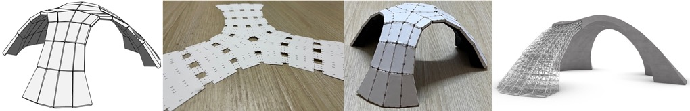
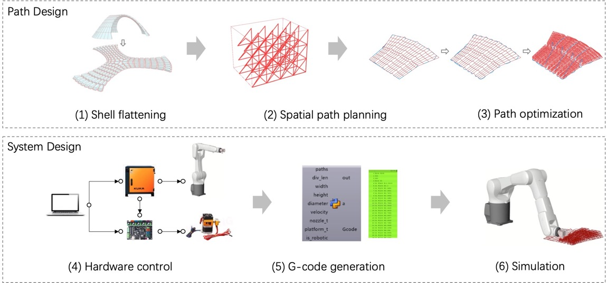
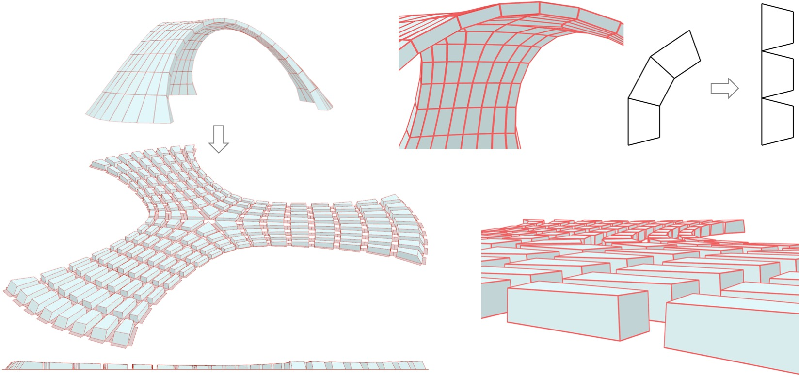
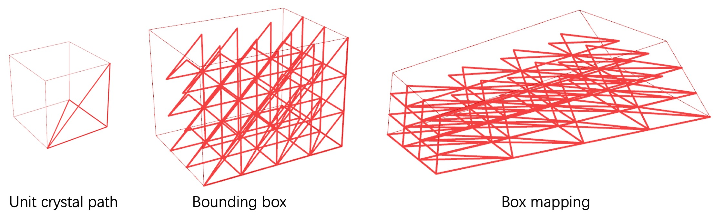
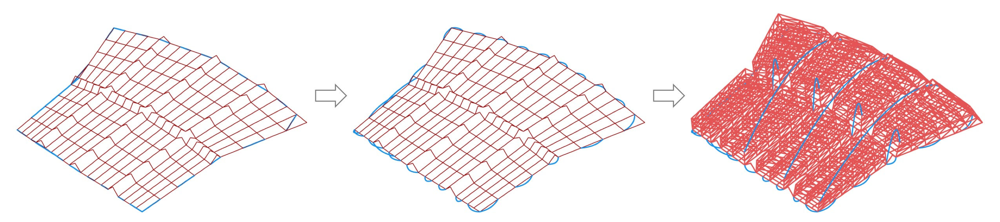

# FoldableShell: a 3D-printed shell framework based on developable surface principles ｜ 基于曲面可展的3D打印壳体框架方法

Shell structures achieve large spatial spans with minimal material, embodying structural efficiency and aesthetic elegance. Traditionally, shells are form-found through physical methods, discretized into numerous templates, and constructed using concrete, brick, or timber—often requiring extensive scaffolding and time-consuming assembly.
We present FoldableShell, a 3D-printed shell framework based on developable surface principles. The target shell is decomposed into discrete volumetric blocks, arranged in a planar layout with controlled spacing, and connected through foldable joints. A continuous 3D printing path is then generated, enabling rapid fabrication via robotic printing. After printing, the structure is folded to recover the intended shell geometry.

## Pipeline

## Shell Flattening

## Path Design

---

## Video Preview
<iframe src="https://player.bilibili.com/player.html?bvid=BV1mCDvBqETr"></iframe>
