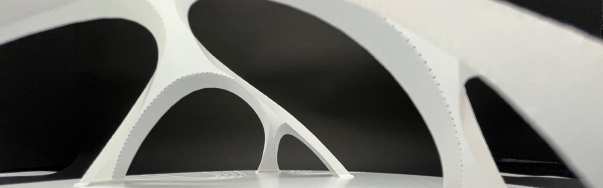
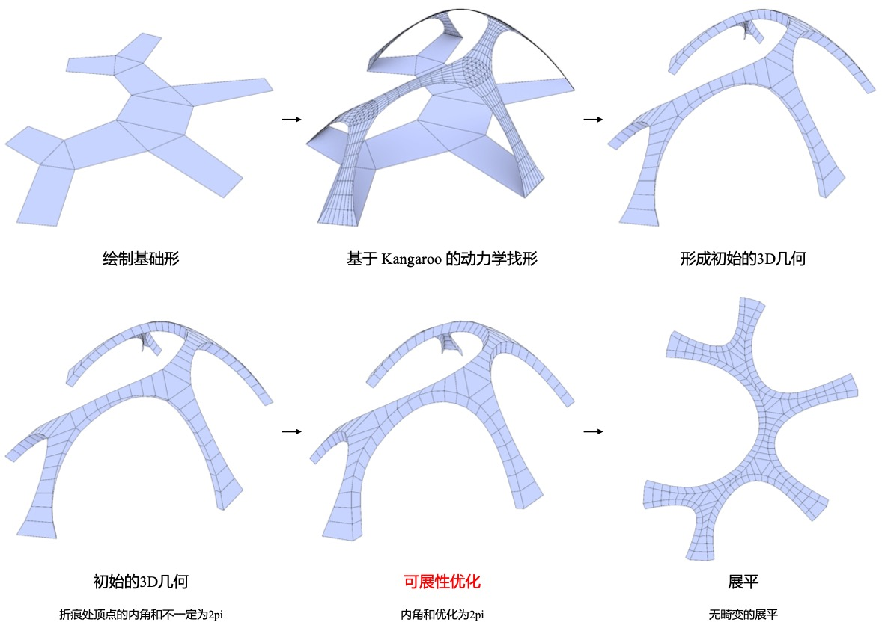
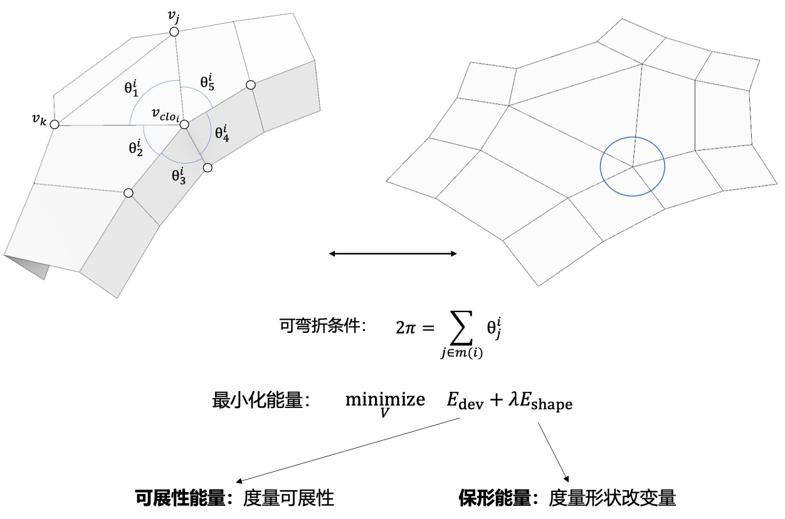
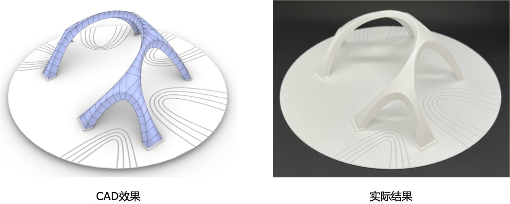
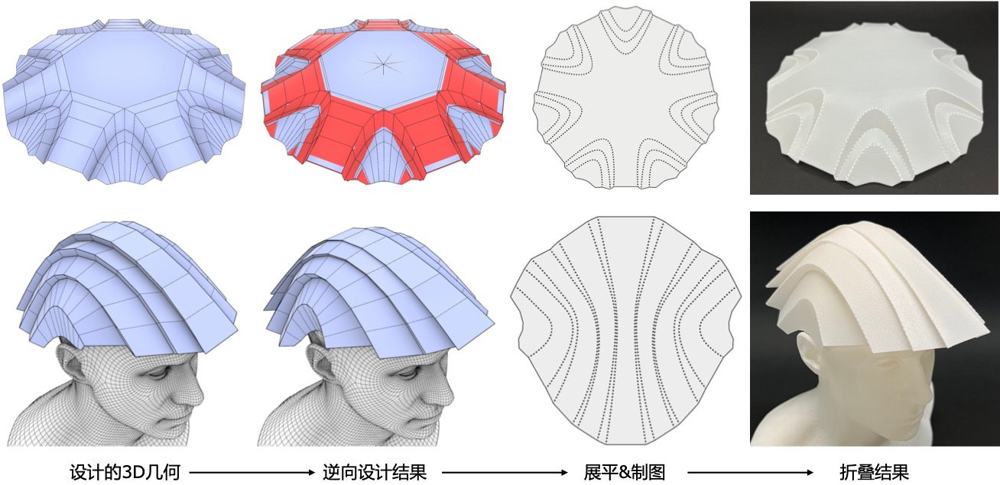

# CurveFolds: A Surface Fabrication Method based on Curve Folding ｜ 基于曲线折纸的曲面制作工艺

Curved-crease folding transforms flat sheets into curved surfaces, offering both artistic expressiveness and practical potential. However, realizing specific complex forms typically requires extensive expertise and iterative trial.

We introduce an inverse design method for curved-crease folding. Designers can first specify a target folded shape without being constrained by strict folding rules. The algorithm then optimizes it into a developable form that can be flattened and refolded into the desired geometry. This approach lowers the barrier to curved folding design and expands the range of achievable forms.

## Pipeline

## Optimization

## Demostration

