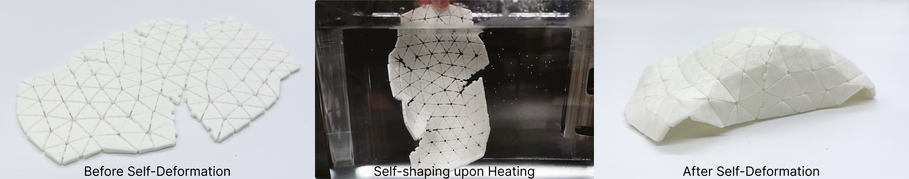
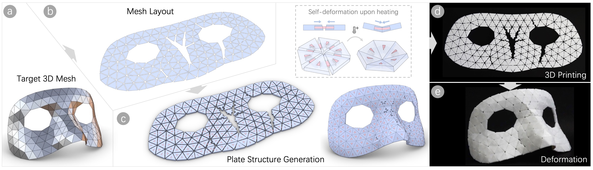
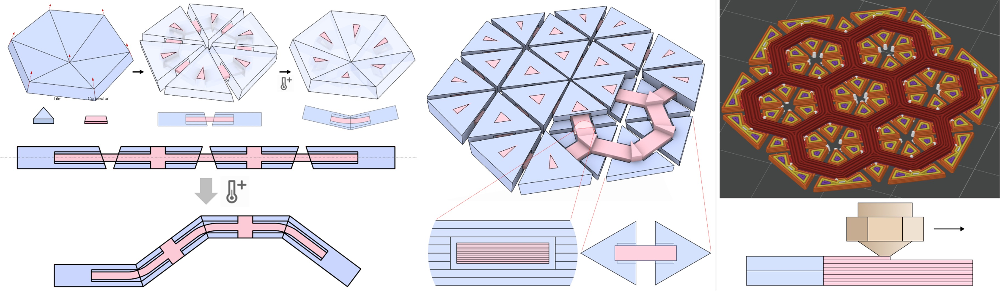
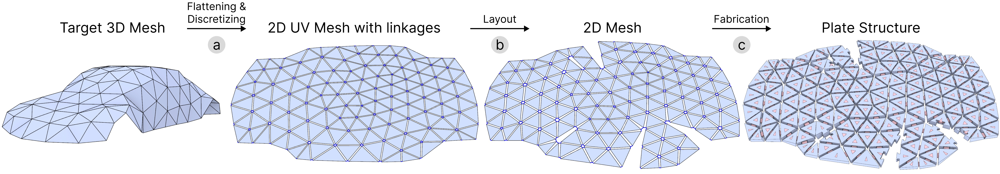
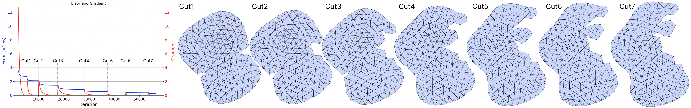
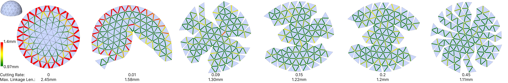
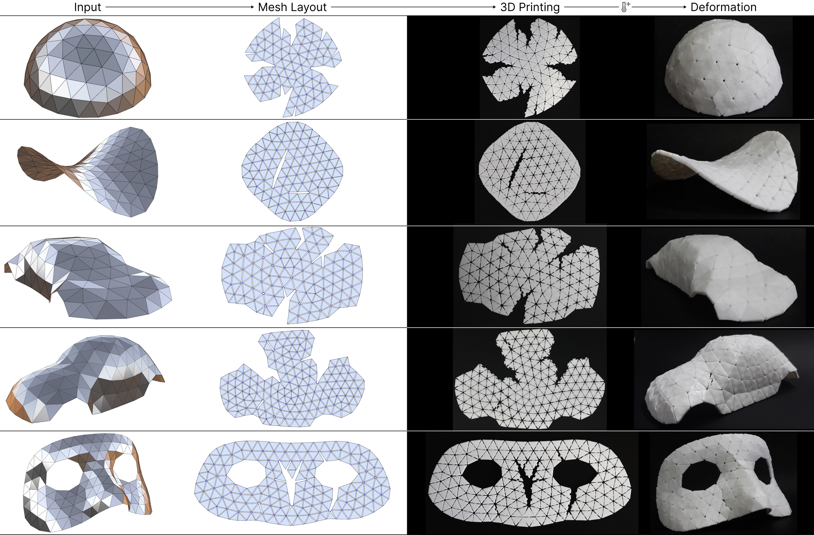
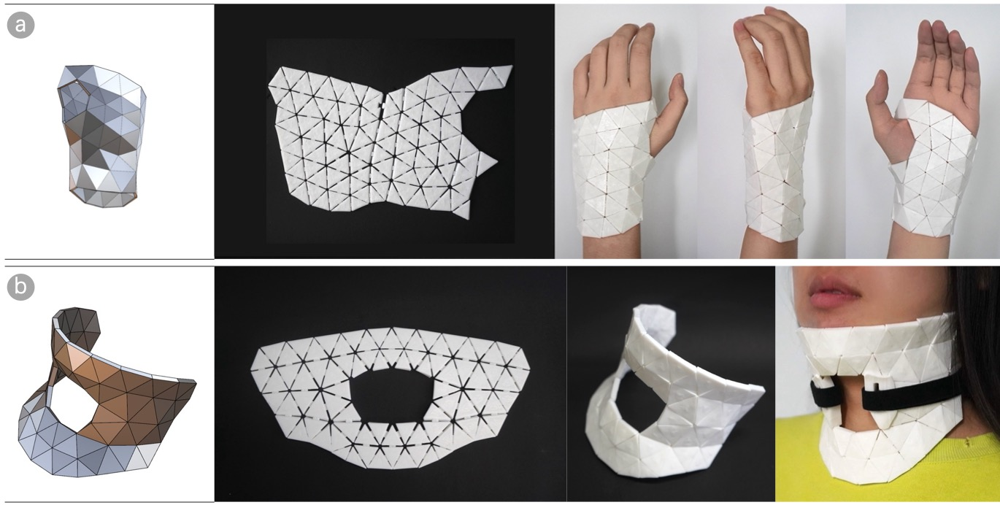

# FreeShell: A Context-Free 4D Printing Technique for Fabricating Complex 3D Triangle Mesh Shells ｜ 基于4D打印的曲面精准形变工艺

Freeform thin-shell surfaces are critical in various fields, but their fabrication is complex and costly. Traditional methods are wasteful and require custom molds, while 3D printing needs extensive support structures and post-processing. Thermal shrinkage actuated 4D printing is an effective method for fabricating 3D shell. However, existing research faces issues related to precise deformation and limited robustness. Addressing these issues is challenging due to three key factors: (1) Difficulty in finding a universal method to control deformation across different materials; (2) Variability in deformation influenced by factors such as printing speed, layer thickness, and heating temperature; (3) Environmental factors affecting the deformation process. To overcome these challenges, we introduce FreeShell, a robust 4D printing technique that uses thermal shrinkage to create precise 3D shells. This method prints triangular tiles connected by shrinkable connectors using a single material. Upon heating, the connectors shrink, moving the tiles to form the desired 3D shape, simplifying fabrication and reducing material and environment dependency. An optimized mesh layout algorithm computes suitable printing structures that satisfy the defined structural objectives. FreeShell demonstrates its effectiveness through various examples and experiments, showcasing precision, robustness, and strength, representing advancement in fabricating complex freeform surfaces.

## Pipeline
Our goal is to fabricate target thin-shell 3D surfaces using context-free 4D printing, enabling precise shape transformation. The fabrication pipeline begins with a target 3D triangular mesh, where all triangles are approximately equilateral and of similar size. The 3D mesh is first discretely flattened into a 2D layout, which serves as the basis for constructing the proposed flat plate structure. This structure is then fabricated via 3D printing and subsequently transformed into the target 3D shape through thermal actuation.

## Structure Design
We present a flat-panel structure composed of assembled triangular tiles designed to achieve precise shaping of a target curved surface through heating. Upon heating, the contraction force of the connectors pulls adjacent tiles tightly together, while the built-in inclination angles on the panels ensure accurate restoration of the intended shape. The structure consists of three key components: tiles that retain their geometry after heating, connectors that draw neighboring tiles together, and beveled edges that enable precise deformation. To ensure thermal stability of the tiles and high shrinkage of the connectors, the printing layer thickness of the tiles is no less than 0.24 mm, while that of the connectors is 0.06 mm. Furthermore, the printing paths of all connectors are aligned with their intended contraction directions.

## 2D Mesh Layout Algorithm
Our goal is to convert a target 3D triangular mesh into an optimized 2D layout for fabricating flat-panel structures for 4D printing. The process follows a three-step pipeline. First, the target mesh is flattened into a 2D UV layout, and adjacent triangles are separated along shared edges, with corresponding vertices connected by connector edges to form a discrete 2D mesh. Next, the 2D mesh layout is optimized while preserving the rigidity of the target triangles and maintaining appropriate gaps between neighboring triangles. During this process, the algorithm automatically removes highly distorted connector edges to preserve triangle stiffness and reduce tension in other connectors. Finally, each target triangle is thickened to form a tile, mapped onto the 2D mesh, and connectors are created based on the retained connector edges, resulting in the final flat-panel structure.

Evolution of mesh layout. After each tension relaxation, the gradient norm increases, and the error further decreases.

Results with different cutting rate. The color code indicates different gap values of the linkage. For example, green indicates the target gap value.

## Applications
We validated our method by fabricating various 3D shapes, including three categories: (1) surfaces with single positive or negative Gaussian curvature (hemisphere, hyperboloid); (2) surfaces with spatially varying curvature (sports car, VW Beetle); and (3) surfaces with holes and high local curvature (mask). These results demonstrate the applicability of our method for diverse geometries. We further demonstrated practical examples by fabricating medical appliances that conform to body curvature and support joint fixation.

---

## Video Preview
<iframe src="https://www.youtube.com/embed/4DUohln4tSI"></iframe>
