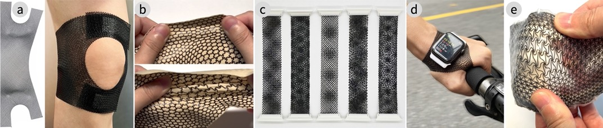
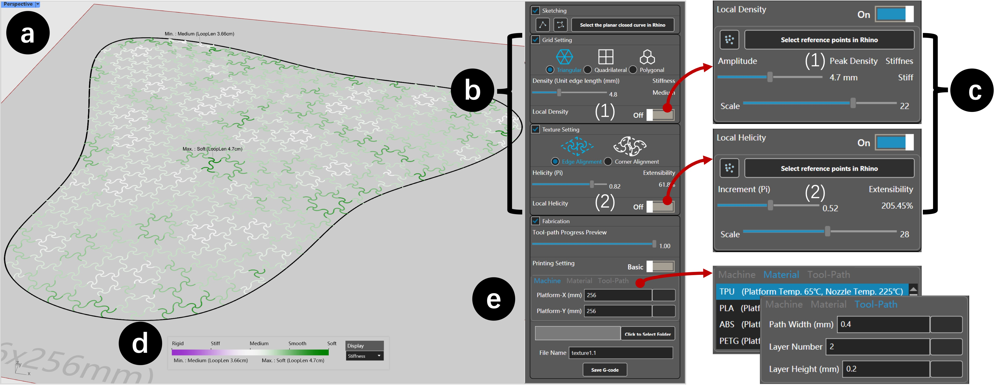
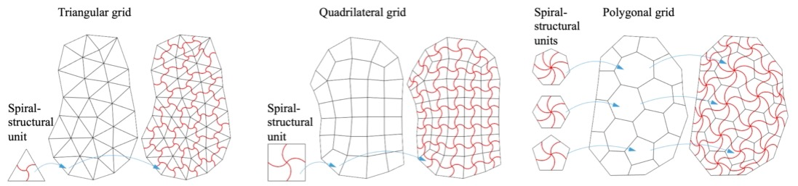
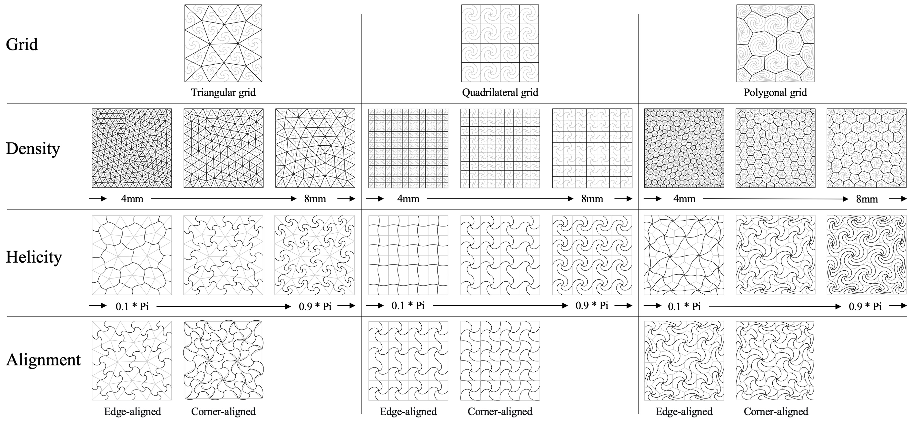
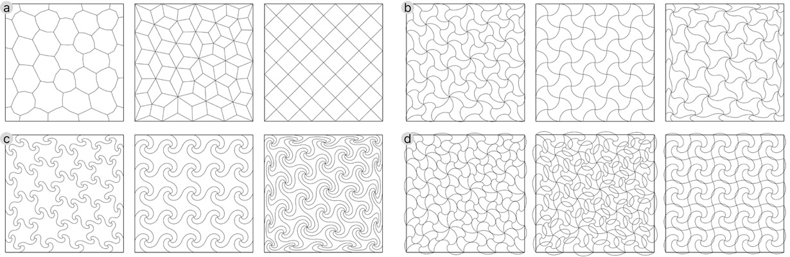
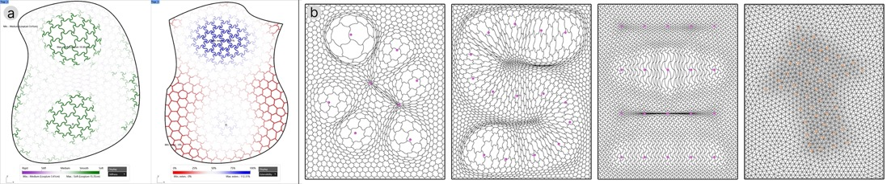
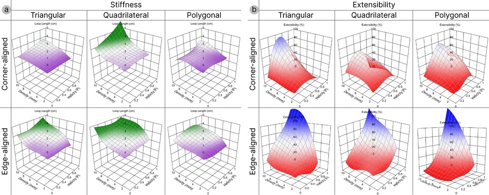

# InterFlex : An Interactive Tool for Designing and 3D-Printing Wearable Flexible Supporting Materials | 3D打印柔性面料数字制造工具

3D-printed stretchable structures are widely applied across domains due to their customizability and rapid fabrication, and have attracted wearable designers for creating personalized, body-conforming wearable supporting materials. However, rapid prototyping of such structures that balance functionality and customization still faces challenges due to structural complexity and reliance on trial-and-error. To address this, we present InterFlex, an interactive design system that integrates structure generation, real-time performance prediction, and fabrication into a unified workflow for efficient prototyping. Users can freely sketch contours to generate diverse structural patterns and control local structural properties. A data-driven predictive model provides real-time feedback on structural performance to accelerate design iteration, while automated G-code generation further streamlines fabrication. We validate the predictive model through quantitative experiments and evaluate the system via case studies and expert interviews. Results demonstrate that our approach significantly improves design efficiency and accessibility.

## Interactive Tool

We present the user interface of our system, featuring a main canvas (a), the design configuration panel (b-c), performance indicator (d), and the fabrication configuration panel (e).

## Method

A stretchable structure is constructed by connecting a network of spiral-structural units through textural tiling within a given contour. Here, a spiral-structural unit is the fundamental building block of our stretchable structure. It is a geometric unit containing a set of extendable concentric Archimedes spirals.

We construct a design space that intuitively supports the generation of diverse structural patterns—such as straight lines, waves, spirals, and floral forms—meeting diverse aesthetic needs while allowing precise control over the mechanical properties of stretchable structures.

The regression models for performance estimation trained under different conditions.

---

## Video Preview
<iframe src="https://player.bilibili.com/player.html?bvid=BV1T1DvBTEuF"></iframe>

