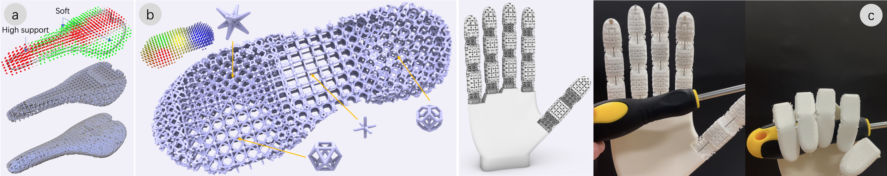
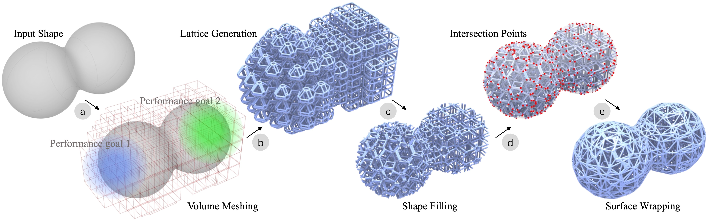
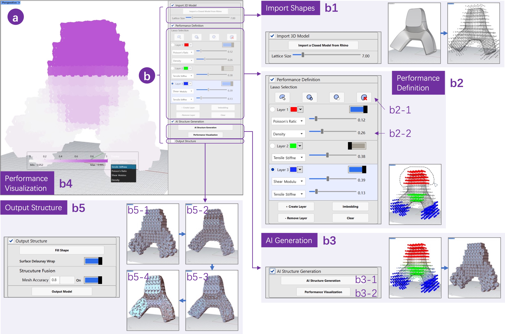
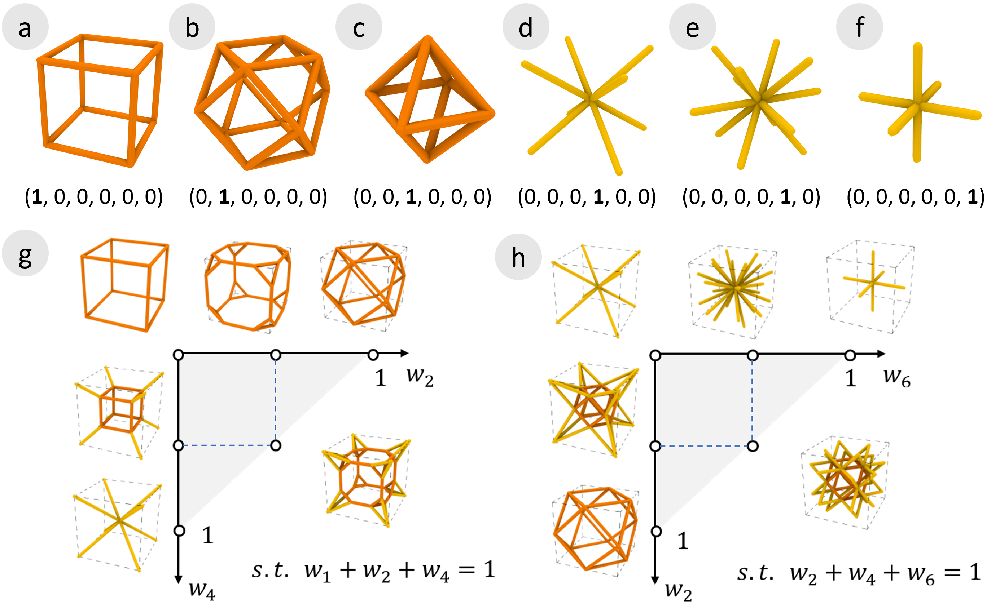
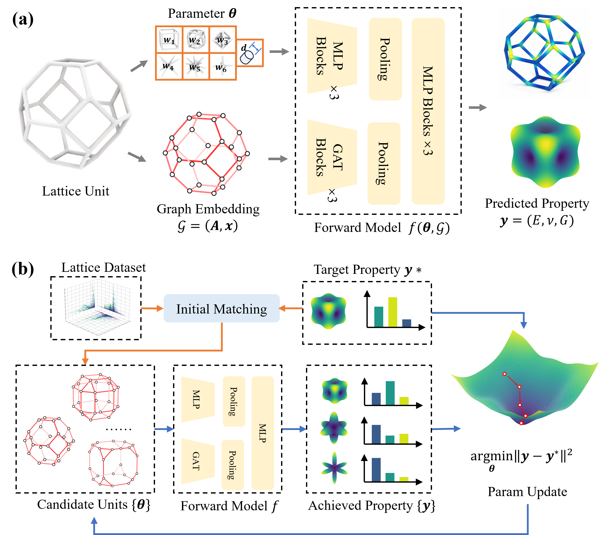

# Perfattice: Interactive Performance-Driven Design of Heterogeneous Lattices ｜ AI驱动的混合晶格逆向设计系统

Designing lattice structures is traditionally a geometry-first process, requiring iterative parameter tuning and simulation to achieve desired mechanical properties. This workflow is unintuitive and inefficient, as user intent is often expressed in terms of performance rather than geometry. We present Perfattice, an interactive system for performance-driven design of heterogeneous lattices. Perfattice enables users to directly specify target properties and interactively explore corresponding structures near real time. It is built on a unified parametric design space that supports continuous transitions across lattice topologies, together with a learning-based inverse model that maps performance objectives to feasible structures. By shifting from geometry-driven to performance-driven interaction, Perfattice supports intuitive control and rapid design exploration. Quantitative results and case studies show that our approach improves efficiency and helps both novice and expert users more effectively achieve target performance goals.

## Pipeline
Our system enables the following usage pipeline. Given a target shape, the system first discretizes it into a set of cubic volumetric cells (a). Users then interactively assign local performance requirements to different regions via the performance editing module. Based on these inputs, the lattice generation module synthesizes corresponding lattice structures for each cell (b). These structures are subsequently assembled and trimmed to conform to the target geometry (c), and optionally wrapped with a continuous outer shell (d–e). Throughout this process, predicted mechanical performance is visualized in situ, enabling users to iteratively refine their design in a closed loop. The final lattice structure can be exported for fabrication via 3D printing. At the core of this workflow is performance-driven lattice synthesis, which we detail in the following section.

## User Interface
Figure illustrates the user interface of Perfattice, which is organized into a main canvas (a) and a control panel (b). The main canvas supports direct visualization and interaction with the lattice geometry, while the control panel provides five functional components: (b1) an import panel for loading input geometries, (b2) a performance specification panel for defining local mechanical requirements, (b3) an AI generation panel for synthesizing lattice structures, (b4) a visualization panel for displaying predicted performance, and (b5) an output panel for exporting final designs.

## Method
We introduce a parametric lattice design space that enables continuous exploration of heterogeneous lattice topologies. Building on this representation, we develop an AI-driven framework for efficiently synthesizing lattice geometries that satisfy user-specified performance targets within the design space.

Example lattices. (a–f) Six structures under extreme weight settings, each generated by activating a single weight while setting others to zero; (g–h) synthesized lattices under mixed weight settings.

AI-driven lattice design framework. (a) Graph-based modeling for lattice performance prediction. (b) Gradient-based design optimization.

---

## Video Preview
<iframe src="https://www.youtube.com/embed/SlkWldrKJv0"></iframe>
